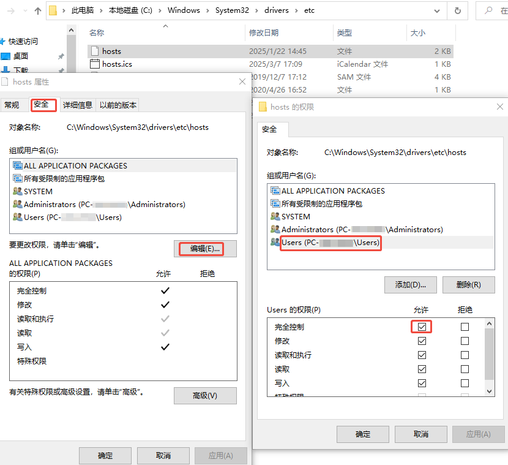

# KMS-WSL2

## 说明

KMS 服务可用于激活量贩版的 Windows 与 Microsoft Office（参考 [03k-kms激活口袋指南](https://blog.03k.org/post/kms.html)），但本机启动的 KMS 不可激活本机，所以需要由另一台机器启动 KMS 服务。由于 WSL2 的实现类似于虚拟机，所以在 WSL2 上启动的 KMS 服务可用于激活 Windows。

vlmcsd 是一个可模拟 KMS 交互的开源项目，在 WSL2 使用 vlmcsd 搭建 KMS 服务，可以方便的实现 Windows 本地自激活。

由于 WSL2 每次开机启动的 IP 地址都会自动更新，所以 WSL2 与 Windows Local 之间的网络交互有点麻烦。[为WSL固定IP的小工具](https://blog.03k.org/post/wsl_switch_mod.html) 提供了一种解决方式，我采用了另一种方式，每次 WSL2 启动的时候通过脚本获取到 WSL2 的 IP 然后更新到 Windows 的 hosts 文件中，通过域名实现 WSL2 与 Windows 之间的交互。

### 脚本实现

1. WSL2 会自动更新 `/etc/resolv.conf` 将 dns 指向 Windows，所以可以通过它来获取 WSL 交换机中 Windows 的 IP。
2. 通过 `ifconfig` 可以获取自身 IP。
3. 通过 `/etc/issue` 获取发行版名称。
4. 生成 hosts 内容，追加或替换相应项。
WSL2 会自动把 Windows 盘符挂载到 `/mnt` 目录下，可以通过 `/mnt/c/Windows/System32/drivers/etc/hosts` 操作 hosts 文件。但由于直接对 hosts 文件 `sed` 操作无法完成预想操作，所以将 hosts 文件拿到本地，替换或追加完成后将内容覆盖回去。

## 使用

可能需要做的准备：为 WSL2 开启 systemd。WSL2 现在支持 systemd，但是需要检查是否启用，参考 [如何启用systemd？](https://learn.microsoft.com/zh-cn/windows/wsl/systemd#how-to-enable-systemd)

1. 在 Windows 为 hosts 文件 `C:\Windows\System32\drivers\etc\hosts` 添加写权限，方便 WSL2 脚本更新 hosts 记录。

2. 在 WSL2 执行 `./setup.sh` 启动 KMS 及 hosts 更新服务。
3. 在 Windows 设置 KMS 服务器，服务器地址为 WSL2 地址。（假设 WSL2 发行版为 debian，设置为`debian.wsl`，具体可查看 步骤1 的 hosts 文件中自动更新的内容。）

安装脚本会添加两个系统服务，`vlmcsd`服务会启动 KMS，`wslhosts`服务会更新 hosts。
